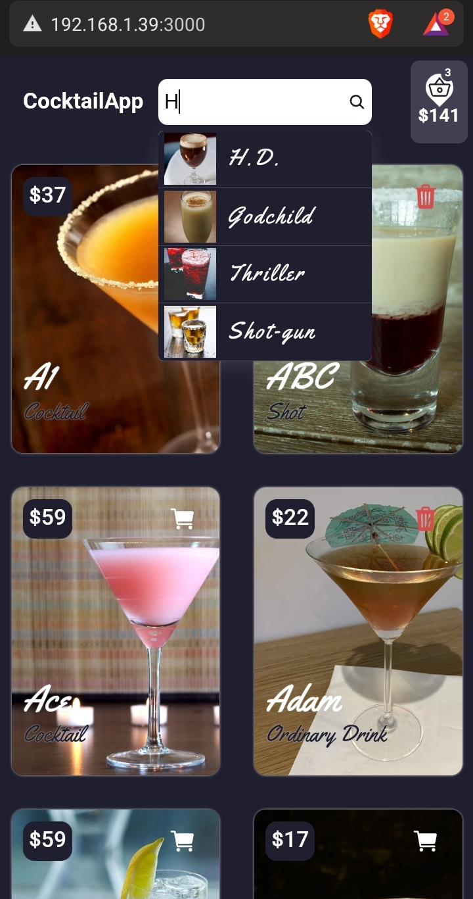

# <center><a href="https://www.thecocktaildb.com/">  </a></center>

1. Realizar una  E-commerce (Tienda) con la siguiente API:
 https://www.thecocktaildb.com/api/json/v1/1/search.php?f=a
2. Añadir un campo ( precio) a cada objeto  “drink”  Bebida. Y mostrar el valor (mostrar foto  , nombre y precio)
3. Crear botón añadir a carrito
Visualizar productos en carrito , y costo  total
4. Subir el examen a tu repositorio en github (ponerlo en modo público) y entregar el link del repositorio

PLUS(no obligatorio): AGREGAR  BUSCADOR  CON EL  SIGUIENTE  API
https://www.thecocktaildb.com/api/json/v1/1/search.php?s=margarita


## Install the modules.

```sh
$ npm install
```

## Run the application

```sh
$ npm run dev
```
## Build mode and production
First we build the app with the following command.
```sh
$ npm run build
```
After running the build command, a folder called "***dist***" was created, in that folder the whole project is located.

To be able to see our project we execute the following.
### preview
```sh
$ npm run preview
```
### production files
inside a new repository[folder] we execute the following console commands.

```sh
$ npm init --y
```
```sh
$ npm i express
```

We create a file called index.js and it will contain the following lines of code.
```JS
const express = require('express')
const path = require('path')

const app= express()

app.use(express.static('public'))
app.get('*',(req,res)=>{
    res.sendFile(path.resolve(__dirname,'public','index.html'))
})
app.use((req, res) => {
    res.status(404).json({
        success: false,
        message: "Pagina no encontrada"
    })
})
app.listen(3000, () => {
    console.log('Server is running on port 3000')
})


```
Having already done the above, rename the folder "***dist***" to the following name "public".
1. We paste in the folder we created.
2. We execute the following command and that's it.
```sh
$ node index.js
```

## Screenshots
### Desktop - Home page


### Desktop - Hart page


### Search box component on home page


### phone - home page


### phone - cart page


### phone - cart page


## <a href="https://www.thecocktaildb.com/api.php">API</a>